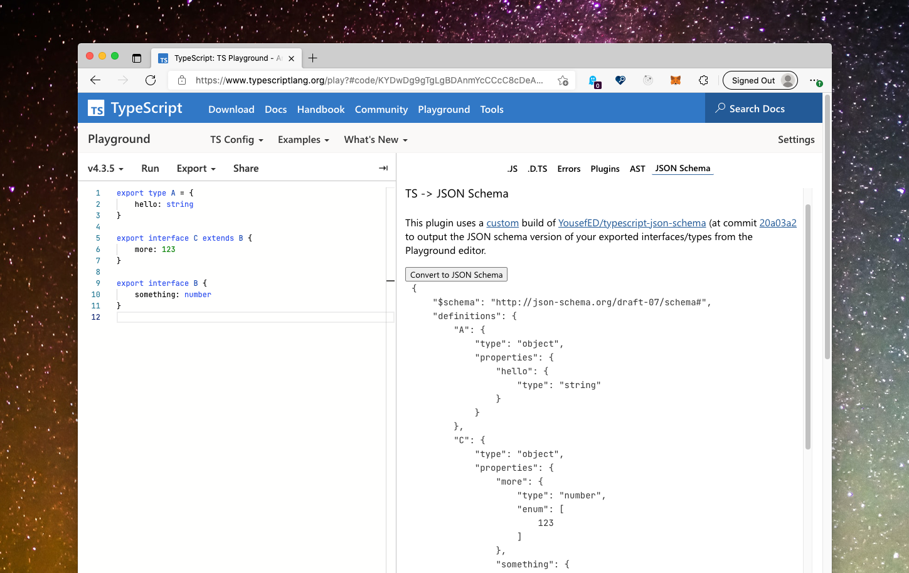

## TypeScript Playground Plugin



This plugin uses a <a href='https://github.com/orta/playground-typescript-json-schema/tree/master/src/lib' target='_blank'>custom</a> build of <a href='https://github.com/YousefED/typescript-json-schema' target='_blank'>YousefED/typescript-json-schema</a> (at commit <a href ='https://github.com/YousefED/typescript-json-schema/tree/20a03a2d2fe81bea56a895cee7975f87fbf480f8' target='_blank'>20a03a2</a> to output the JSON schema version of your exported interfaces/types from the Playground editor.


## Running this plugin

- [Click this link](https://www.typescriptlang.org/play?install-plugin=playground-typescript-json-schema) to install

or

- Open up the TypeScript Playground
- Go the "Plugins" in the sidebar
- Look for "Plugins from npm"
- Add "playground-typescript-json-schema"
- Reload the browser

Then it will show up as a tab in the sidebar.

## Contributing

See [CONTRIBUTING.md](./CONTRIBUTING.md) for the full details, however, TLDR:

```sh
git clone ...
yarn install
yarn start
```

Then tick the box for starting plugin development inside the TypeScript Playground.
